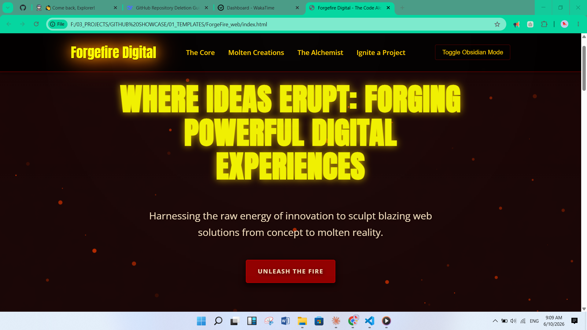
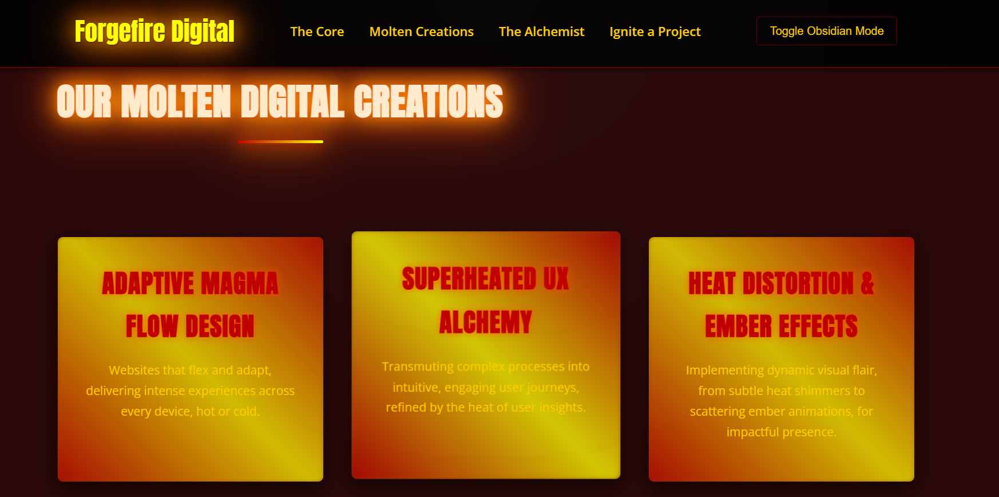
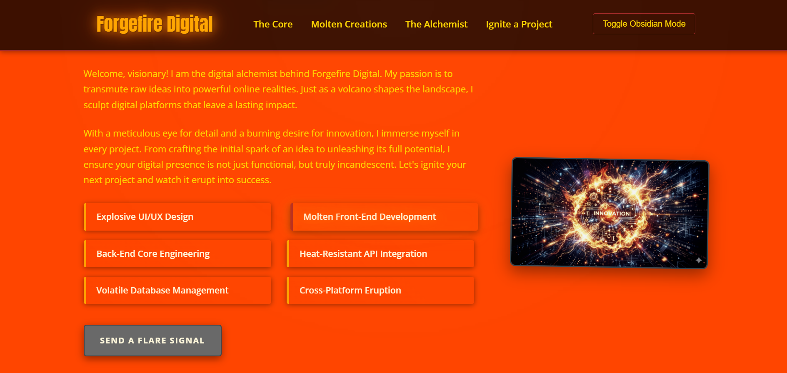

# 🌋 Forgefire Digital - The Code Alchemist 🧪

Forgefire Digital is a visually striking, volcanic-themed web template designed for digital agencies, portfolios, or creative studios. It features a dynamic "Obsidian Mode" toggle, high-performance interactive particle effects, and a fully responsive mobile-first architecture.

## 📸 Visuals

### Home Page

### Services & Creations

### About Section


## 🔥 Features

-   **Volcanic Aesthetic:** A unique design language inspired by magma, ash, and tectonic energy.
-   **Obsidian Mode:** A seamless theme toggle between "Day" (Active Volcano) and "Night" (Deep Obsidian) using CSS Custom Properties.
-   **Dynamic Particles:** Interactive rising embers powered by `particles.js` that adjust their color, size, and intensity based on the active theme.
-   **Mobile-First Design:** Fully responsive layout ensuring a powerful experience from smartphones to ultra-wide monitors via `responsive.css`.
-   **Forged Animations:** Smooth transitions, heat distortion effects, and scroll-triggered reveals.

## 🛠️ Technologies Used

-   **HTML5:** Semantic structure for modern web standards.
-   **CSS3:** Custom properties (variables), Flexbox, Grid, and keyframe animations.
-   **JavaScript (ES6):** Theme toggling logic and dynamic DOM manipulation.
-   **Particles.js:** Lightweight library for the rising ember background effects.
-   **Google Fonts:** 'Anton' for high-impact headings and 'Open Sans' for readability.

## 🚀 Getting Started 🏗️

To get a local copy up and running, follow these simple steps:

### 👯 Cloning the Repository

1.  **Open your terminal and run:**
    ```bash
    git clone https://github.com/affan675/Forgefire_Digital.git
    ```
2.  **Navigate into the directory:**
    ```bash
    cd Forgefire_Digital
    ```
3.  **Open the project:**
    Simply open `index.html` in any modern web browser to view the site.

## 📂 Project Structure 📁

-   `index.html`: The core structure and content of the website.
-   `style.css`: Main styling, theme color definitions, and global animations.
-   `responsive.css`: Mobile-first media queries for cross-device compatibility.
-   `script.js`: Theme switching logic and particle engine initialization.
-   `particles.js`: The library for the interactive ember effects.

## 🎨 Customization 🛠️

You can easily modify the intensity of the "heat" by adjusting the CSS variables in the `body[data-theme="day"]` and `body[data-theme="night"]` blocks within `style.css`.

## 🤝 Contributing

Contributions are what make the open-source community such an amazing place to learn, inspire, and create. Any contributions you make are **greatly appreciated**.

1. Fork the Project
2. Create your Feature Branch (`git checkout -b feature/AmazingFeature`)
3. Commit your Changes (`git commit -m 'Add some AmazingFeature'`)
4. Push to the Branch (`git push origin feature/AmazingFeature`)
5. Open a Pull Request

## 📜 License 📄

This project is open-source. The `particles.js` library is provided under the MIT license by Vincent Garreau.

---

## 👤 Creators & Contact 🌋

**Affan Adil** - *The Code Alchemist*

- 📧 **Email:** affanadil119@gmail.com
- 🐙 **GitHub:** [@affan675](https://github.com/affan675)
- ⌛ **WakaTime:** [@affan675](https://wakatime.com/@affan675)
- 🖋️ **CodePen:** [@affan675](https://codepen.io/affan675)